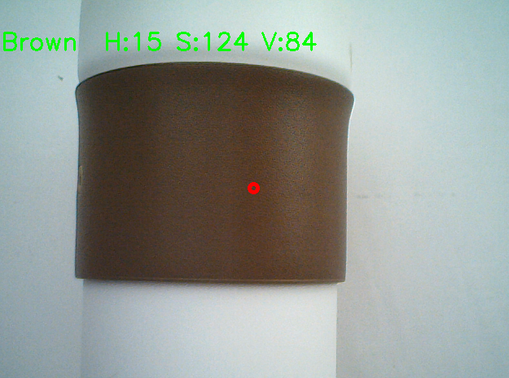
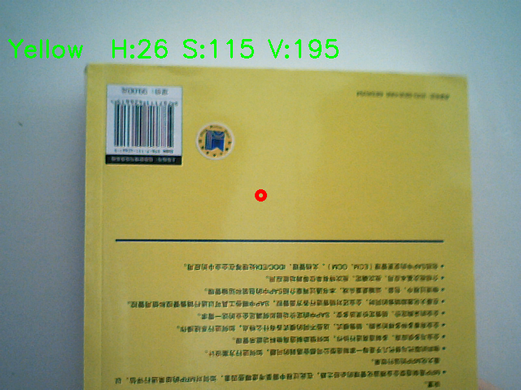

# Color Recognition Project

## 项目简介
使用 Python + OpenCV 实现实时颜色识别。通过摄像头捕捉画面，获取画面中心点颜色，并根据 HSV 值判定基础颜色（黑、白、红、橙、黄、绿、青、蓝、紫、棕等）。

## 项目功能
1. 打开摄像头获取实时视频流
2. 转换到 HSV 色彩空间
3. 获取画面中心点颜色并判断颜色类型
4. 在视频上显示颜色名称和 HSV 值
5. 可按 `ESC` 键退出

## 使用方法
1. 安装依赖：
pip install opencv-python

2. 运行项目：
python color_recognition.py

## 文件结构
color_recognition/
├─ color_recognition.py
├─ README.md
├─ example1.png
└─ example2.png

## 示例效果
实时显示摄像头中心点颜色及 HSV 值

在视频中用圆标记中心点

效果截图：

